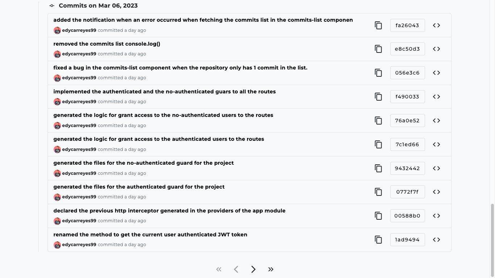

# QuantumGit

**Built to track all commits of a git repository with your GitHub account.**

## Development server

Preferred to have node.js version `18.15.0`. You can use [nvm](https://github.com/nvm-sh/nvm) to manage node.js
versions.

Once already node.js is installed in your computer, you can run `npm i` to install all the dependencies required in this
project.

`Environment` variables are required to run this project locally. So you need to create 2 files in `src/environments`
folder. One is `environment.ts` and another is `environment.prod.ts`. You can copy the content
from `environment.example.ts` and paste it in the respective files. Then you need to
add the values for the variables.

Then you can run the `ng serve` command for a dev server. Navigate to `http://localhost:4200/`. The application will
automatically reload if you change any of the source files.

## Build

Preferred to have node.js version `18.15.0`. You can use [nvm](https://github.com/nvm-sh/nvm) to manage node.js
versions.

Once already node.js is installed in your computer, you can run `npm i` to install all the dependencies required in this
project.

`Environment` variables are required to run this project locally. So you need to create 2 files in `src/environments`
folder. One is `environment.ts` and another is `environment.prod.ts`. You can copy the content
from `environment.example.ts` and paste it in the respective files. Then you need to
add the values for the variables.

Run `ng build` to build the project. The build artifacts will be stored in the `dist/` directory.

## Info

This project was thinking to be a fully scalable project, that's because I made the current project's folders structure
to be scalable. So if you want to add a new module, you can create a new folder in `src/app` and add all the files on
it, each module can implement the lazy-loading feature of angular to manage all child components. Also, the service's
implementation is fully scalable becase I create an inherited class like a `BaseService` class, so you can create a
new service and inherit from the `BaseService` class, and you will have all the methods to manage the data in the
database, apart from that all the code is very clean.

This project is developed with validations from both sides (client and server). So you can see the validations in the
forms
that are used in this project. Also, you can see the validations in the server side. You can see the validations in the
following URL [https://quantum-git.up.railway.app/api/](https://quantum-git.up.railway.app/api/).

The UI that I choose is a combination of [Material](https://material.angular.io/)
and [Bootstrap](https://getbootstrap.com/), with flat design and minimalist colors, this for have a better clean
interface.

I used the [Firebase Authentication](https://firebase.google.com/docs/auth/web/start?hl=es-419) service with
the [GitHub](https://firebase.google.com/docs/auth/web/github-auth?hl=es-419) provider to manage the user's
authentication.

## Dependencies

The dependencies that I use in this project, all of them are very useful, and they are the most used in the community.

* **@angular/fire** - This is the official Angular library for Firebase, I used firebase to manage the login services
  and the storage services to improve the time, I'm sending a JWT generated by the own firebase auth module to the
  backend side on each http request.

* **@angular/material** - This is the official Angular library for Material Design, I used this library to have a
  better UI, and I used the components that I needed to have a better UI.

* **bootstrap** - I used this library combined with the @angular/material in cases of GRID and some color or text
  variables.

* **moment.js** - I used this library to manage in an easy way the dates in the app.

* **ngx-toastr** - I used this library to show the notifications in the UI, this library is very useful to show
  notifications in the UI.

## Attachments

